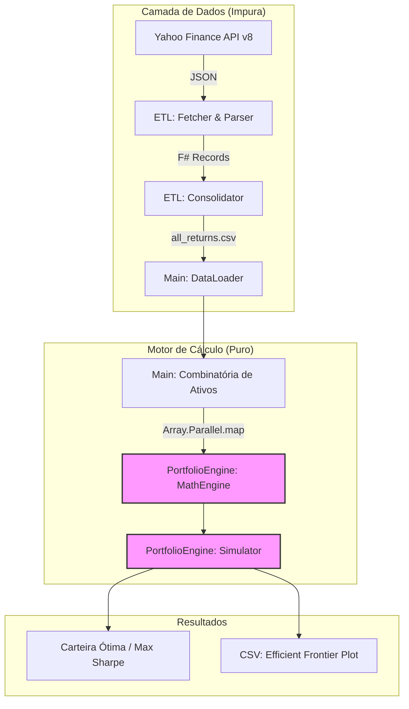

# Otimizador de Portfólio Dow Jones (Monte Carlo & Parallel F#)

Este repositório contém um motor de otimização de ativos de alta performance desenvolvido em **F#**. O sistema utiliza simulações de Monte Carlo massivamente paralelas para explorar o espaço combinatório das ações do Dow Jones (DJIA), identificando a alocação que maximiza o **Sharpe Ratio** sob restrições estritas de concentração.

O projeto foi desenvolvido como requisito final para a disciplina de **Programação Funcional** no **Insper (2026-1)**.

## 1. Fluxo de Execução (Arquitetura)

O sistema segue um modelo de pipeline funcional, partindo da extração de dados brutos até a geração da Fronteira Eficiente.



## 2. Estrutura da Solution

A arquitetura foi desenhada seguindo princípios de **Domain-Driven Design (DDD)** e **Clean Architecture**, isolando os efeitos colaterais da lógica de negócio.

* **`ETL` (Library)**: Responsável pela ingestão. Utiliza o módulo `Fetcher` para chamadas assíncronas ao Yahoo Finance (v8 chart API) e o `Parser` para transformar o JSON em tipos nativos, consolidando tudo em uma matriz única no `Transform`.
* **`PortfolioEngine` (Library - Pura)**:
* `Domain.fs`: Definições de tipos imutáveis (`Weights`, `CovarianceMatrix`).
* `MathEngine.fs`: Álgebra linear otimizada para cálculo de $\sigma$ e $\mu$.
* `Simulator.fs`: Implementação do Monte Carlo com lógica **híbrida (Water-filling)** para garantir pesos $\le 20\%$.


* **`Main` (Console App)**: Orquestrador que gerencia o paralelismo de CPU para processar as ~174.000 combinações de ativos possíveis.

## 3. Diferenciais Técnicos

* **Paralelismo Massivo**: Uso de `Array.Parallel.map` para distribuir o processamento por todos os núcleos da CPU, permitindo simular milhões de carteiras em segundos.
* **Imunidade Cultural**: Parsing numérico via `CultureInfo.InvariantCulture`, garantindo que o sistema funcione perfeitamente em ambientes Linux/WSL independentemente da localização.
* **Robustez de Dados**: Implementação de *Forward Fill* no carregamento de dados para tratar eventuais lacunas de feriados ou falhas na API.
* **Estratégia de Pesos Híbrida**: Combinação de sorteio aleatório com algoritmo de redistribuição recursiva para satisfazer a restrição de $w_i \le 0.2$ sem desperdiçar iterações.

## 4. Fundamentação Matemática

A otimização busca a carteira que maximiza:


$$SR = \frac{E[R_p] - r_f}{\sigma_p}$$

Onde a volatilidade da carteira ($\sigma_p$) é calculada via forma quadrática:


$$\sigma_p = \sqrt{w^T \Sigma w} \times \sqrt{252}$$

## 5. Como Executar

### Pré-requisitos

* .NET 8.0 SDK ou superior.
* Ambiente Linux/WSL recomendado.

### Rodar o Pipeline Completo

```bash
# 1. Compilar o projeto
dotnet build

# 2. Executar o motor (Extração + Simulação)
dotnet run --project Main

```

Os resultados serão exibidos no console e o arquivo `data/efficient_frontier.csv` será gerado para plotagem.

## 6. Autoria

Projeto desenvolvido por Bruno Drezza como parte da graduação em Economia no Insper.

Os resultados serão exibidos no console e o arquivo `data/efficient_frontier.csv` será gerado para plotagem.

## 6. Autoria

Projeto desenvolvido por Bruno Drezza como parte da graduação em Economia no Insper.
