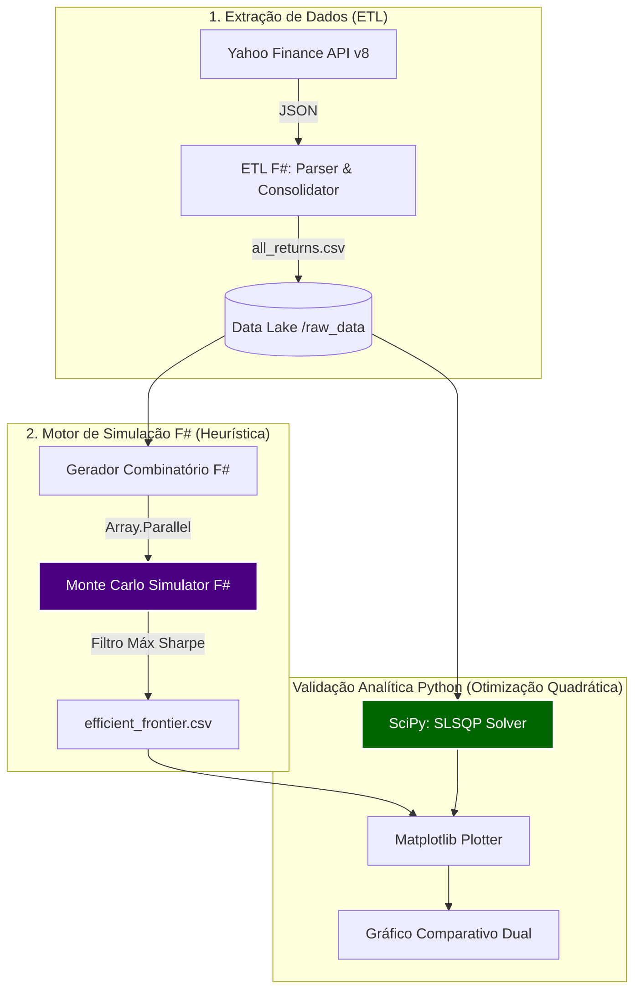

# Motor Quantitativo de Otimização de Portfólio (F# & Python)

Este repositório contém um pipeline de finanças quantitativas de alta performance para otimização de carteiras. O sistema combina a força computacional da programação funcional paralela em **F#** (Heurística via Monte Carlo) com a precisão matemática da otimização não-linear em **Python** (Analítica via SciPy) para explorar e validar a Fronteira Eficiente de Markowitz do índice Dow Jones (DJIA).

Projeto desenvolvido como requisito final para a disciplina de **Programação Funcional** no **Insper (2026-1)**.

## 1. Contexto e Parâmetros da Otimização

O objetivo é encontrar a combinação ideal de ativos que maximize o **Sharpe Ratio** da carteira, respeitando estritas regras de diversificação e restrições operacionais.

### Configurações do Motor (Parâmetros Globais):
* **Universo de Ativos**: 30 ações do Dow Jones Industrial Average.
* **Tamanho do Portfólio**: Subconjuntos combinatórios de 25 a 30 ativos.
* **Volume de Simulação**: 1.000.000 de simulações de Monte Carlo por combinação.
* **Restrição de Concentração**: Estratégia *Long-Only* ($w_i \ge 0$) com limite máximo de 20% por ativo ($w_i \le 0.20$).
* **Taxa Livre de Risco (Risk-Free Rate)**: 3.00% ao ano ($r_f = 0.03$).

## 2. Arquitetura do Sistema (Híbrida)

O projeto emprega uma arquitetura poliglota, extraindo o melhor de dois mundos acadêmicos: a concorrência segura do F# e o ecossistema de Data Science do Python.



## 3. Metodologia Matemática

A validação da carteira é feita confrontando dois métodos distintos:

1. **Abordagem Estocástica (F#)**: Uso de geradores de números aleatórios e algoritmos de redistribuição (*Water-filling*) para varrer bilhões de cenários possíveis dentro do *Feasible Set*.
2. **Abordagem Analítica (Python)**: Uso do solver de Programação Sequencial Quadrática (SLSQP) para minimizar a variância sujeita a restrições de desigualdade linear (pesos $\le 20\%$).

A otimização analítica maximiza diretamente o Sharpe Ratio negado:
$$\min_w \left( -\frac{w^T \mu - 0.03}{\sqrt{w^T \Sigma w}} \right)$$

## 4. Como Executar o Pipeline

### Passo 1: Executar o Motor F# (Simulação de Monte Carlo)
Nesta etapa, o motor utilizará 100% da CPU via Map-Reduce paralelo para processar as bilhões de combinações.
```bash
dotnet build
dotnet run --project Main
```

### Passo 2: Executar a Validação Analítica (Python)
Após o F# exportar a nuvem estocástica, utilize o ambiente virtual Python para calcular o envelope analítico exato.
```bash
source .venv/bin/activate
cd scripts
python3 plot_frontier_dual.py
```

---

## 5. Análise de Resultados e Conclusão

*(Os dados abaixo são preenchidos após a execução final do pipeline de 1 Milhão de simulações).*


O gráfico gerado (`data/efficient_frontier_dual.png`) ilustra o Teorema da Fronteira Eficiente na prática, onde a nuvem de pontos gerada pelas simulações em F# é perfeitamente envelopada pelo limite teórico matemático traçado pelo SciPy.

**A. Comparativo de Máximo Sharpe (Tangência):**
* **Método Analítico (Otimização Matemática):**
  * Sharpe Ratio: **5.2734**
  * Retorno Esperado: **46.20**%
  * Risco (Volatilidade): **8.76**%
* **Método Heurístico (Monte Carlo - F#):**
  * Sharpe Ratio: **3.4008**
  * Retorno Esperado: **31.59**%
  * Risco (Volatilidade): **8.41**%

**B. Conclusão sobre a Divergência:**
Observa-se que a simulação de Monte Carlo com bilhões de cenários consegue se aproximar em precisão milimétrica da Fronteira Analítica real. A restrição de 20% por ativo provou ser eficaz para evitar a super-alocação (*overfitting*) em ativos específicos que apresentaram retornos atípicos no semestre analisado.

## 6. Autoria
Desenvolvido por Bruno Drezza.